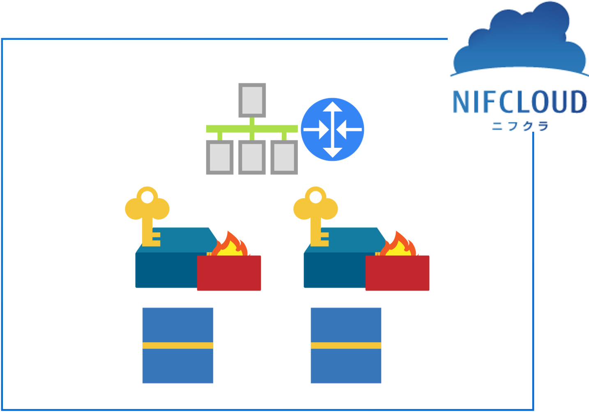

# Terraform Demo

This is a simple terraform demo for [NIFCLOUD](https://pfs.nifcloud.com/)  
This repository uses [Terraform Provider for NIFCLOUD](https://github.com/nifcloud/terraform-provider-nifcloud)

## Usage

To use this example, you need to add environment variables  with the following content:

```:bash
export NIFCLOUD_DEFAULT_REGION=jp-east-1
export NIFCLOUD_ACCESS_KEY_ID=my-access-key
export NIFCLOUD_SECRET_ACCESS_KEY=my-secret-key
```

## Execute

Then execute the plan using terraform:

```:bash
terraform init   # to initializes the working directory
terraform plan   # to show the plan
terraform apply  # to apply the changes
```

You can see these resources are created in the cloud.  
Enjoy!

 
